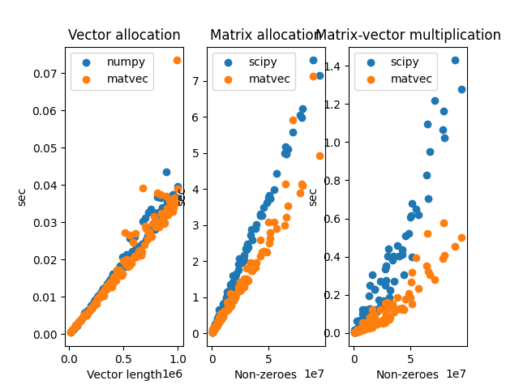

# matvec

A domain-specific language for fast graph shift operations.
This implements mathematical fields on numbers,
n-dimensional column vectors, and n-by-n sparse matrices.

**License:** Apache Software License
<br>**Author:** Emmanouil (Manios) Krasanakis
<br>**Dependncies:** *numpy*

# :zap: Quickstart
Creating a 5-dimensional vector:
```python
from matvec import Vector
x = Vector([1, 2, 3, 4, 5])
```

Creating a 5x5 sparse matrix A in coo-format 
with non-zero elements A[1,2]=9 and A[3,0]=21
```python
from matvec import Matrix
A = Matrix([1, 2],
           [3, 0],
           [9, 21],
           5)
```

Print the outcome of matrix-vector multiplication:
```python
print(A*x)
```

Print the outcome of left-multiplying transpose(x)
with A:
```python
print(x*A)
```

# :fire: Features
:rocket: Parallelized matrix-vector multiplication.<br>
:chart_with_downwards_trend: Memory reuse optimization.<br>
:mag: numpy compatibility.<br>
:factory: Common arithmetic operations.<br>

# :volcano: Benchmark
Experiments run on a machine witj 2.6 GHz CPU base clock,
up to 4.4 GHz turbo boost of that clock, 12 logical
cores, and 16GB DDR3 RAM.
More rigorous evaluation will take place in the future.

| Task                                   | numpy/scipy | matvec    |
|----------------------------------------|-------------|-----------|
| Allocate vectors with 2E6 elements     | 0.101 sec   | 0.106 sec |
| 1000 temp. additions with 2E6 elements | 4.067 sec   | 2.265 sec |
| Allocate matrix with 2E6 non-zeros     | 0.231 sec   | 0.073 sec |
| Sparse matrix with vec multiplication  | 0.024 sec   | 0.012 sec |

