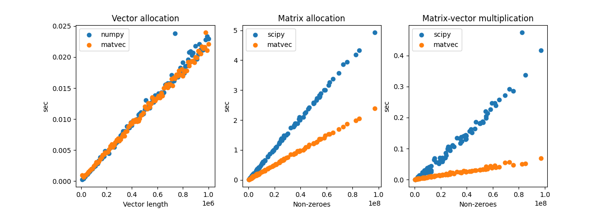

A domain-specific language for fast graph shift operations.
This implements mathematical fields on numbers,
n-dimensional column vectors, and n-by-n sparse matrices.

**License:** Apache Software License
<br>**Author:** Emmanouil (Manios) Krasanakis
<br>**Dependencies:** `numpy`

# :zap: Quickstart
Creating a 5-dimensional vector (can use `numpy` arrays 
as inputs interchangeably with lists everywhere):
```python
from matvec import Vector
x = Vector([1, 2, 3, 4, 5])
```

Creating a 5x5 sparse matrix `A` in coo-format 
with non-zero elements `A[1,2]=9` and `A[3,0]=21`
```python
from matvec import Matrix
A = Matrix([1, 2],
           [3, 0],
           [9, 21],
           5)
```

Print the outcome of matrix-vector multiplication:
```python
print(A*x)
```

Print the outcome of left-multiplying the transpose of x
with A:
```python
print(x*A)
```

# :fire: Features
:rocket: Parallelized matrix-vector multiplication.<br>
:chart_with_downwards_trend: Memory reuse optimization.<br>
:mag: numpy compatibility.<br>
:factory: Common arithmetic operations.<br>

# :volcano: Benchmark
Benchmarks tested on a machine with up to 5.2 GHz turbo frequency,
24 logical cores, and 32GB DDR3 RAM. They span vectors of 1.E4 to
1.E6 elements and matrices with non-zeroes up to 100x the number of
vector elements (that is, if the matrices represented graphs, 
expected node degrees would be up to 100).

**For a lot of non-zeroes paralellization may be worse than scipy.**


| Task                                     | numpy/scipy | matvec    |
|------------------------------------------|-------------|-----------|
| Create new vector or array               | 0.012 sec   | 0.011 sec |
| 1000 temp. additions of 1.E6 vectors     | 0.446 sec   | 0.066 sec |
| Create matrix                            | 1.373 sec   | 0.659 sec |
| Sparse matrix with vector multiplication | 0.099 sec   | 0.019 sec |




# :memo: List of Operations
* Full arithmetic operations `* + - / == < > <= >=` between
vectors and other vectors or scalars.
* Matrix-vector multiplication `*` (both left and right).
* Element access and assignment for vectors with `[]`.
* Masking, such as `y = x[x>0]`.
* `matvec.clear()` clears cache.